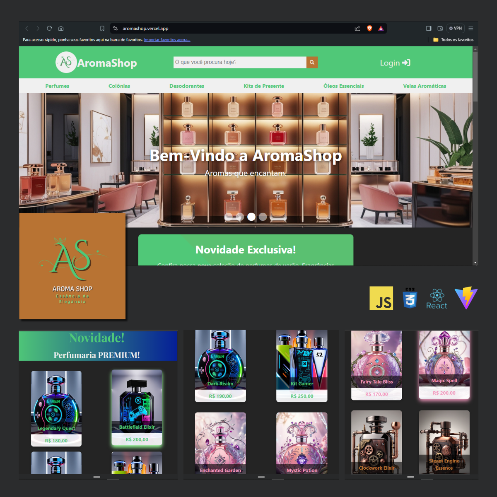

# AromaShop - Landing Page

Este é um projeto de landing page desenvolvido para treinar habilidades frontend utilizando React.js.

## DEMO
[AromaShop](https://aromashop.vercel.app/)

##

## Visão Geral



A AromaShop é uma landing page fictícia para uma perfumaria virtual. O projeto inclui diferentes seções como banners rotativos de produtos, menu responsivo, e cards de produtos organizados por linhas temáticas.

## Tecnologias Utilizadas

- React.js
- CSS (utilizando módulos CSS para estilos específicos de componentes)
- Font Awesome (para ícones)
- Vite (para o ambiente de desenvolvimento)

## Como Baixar e Rodar o Projeto Localmente

1. **Clone o repositório:**

   ```bash
   git clone https://github.com/BMinority/REACT_AromaShop.git

2. **Instale as dependências:**

    ``` bash
    cd aromashop
    npm install

2. **Rode o projeto:**

    ``` bash
    npm run dev


## Contribuição
Contribuições são bem-vindas! Sinta-se à vontade para fazer um fork do projeto e enviar suas melhorias através de pull requests.

##

# React + Vite

This template provides a minimal setup to get React working in Vite with HMR and some ESLint rules.

Currently, two official plugins are available:

- [@vitejs/plugin-react](https://github.com/vitejs/vite-plugin-react/blob/main/packages/plugin-react/README.md) uses [Babel](https://babeljs.io/) for Fast Refresh
- [@vitejs/plugin-react-swc](https://github.com/vitejs/vite-plugin-react-swc) uses [SWC](https://swc.rs/) for Fast Refresh
